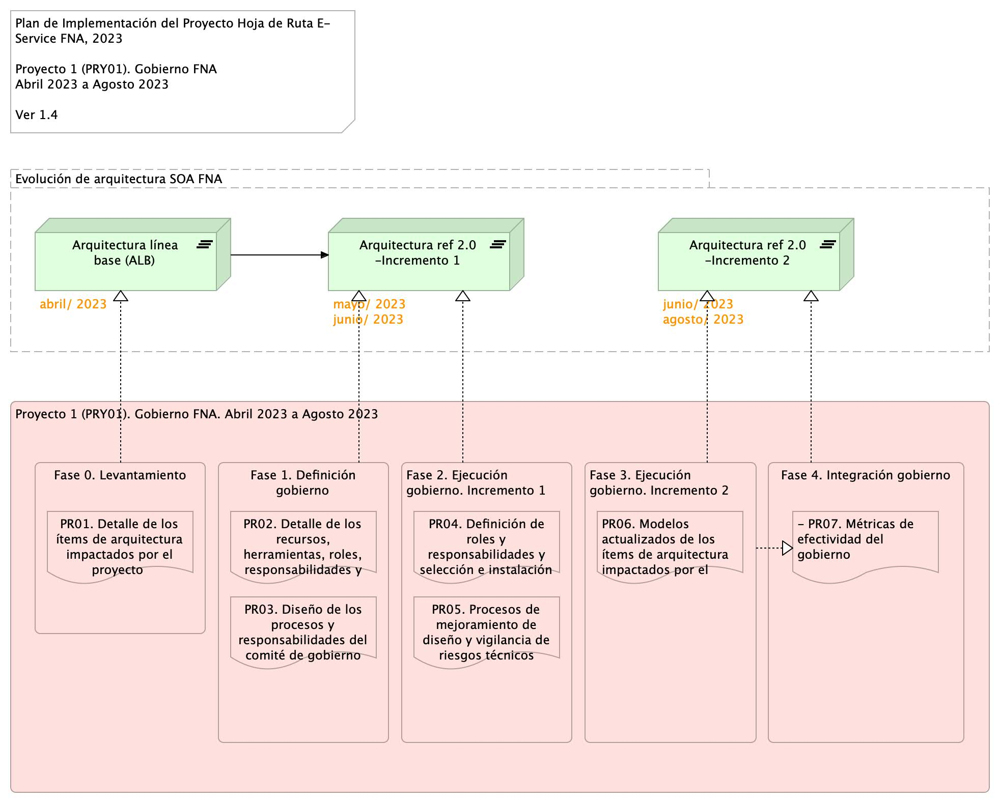

---
geometry:
  - top=1in
  - bottom=1in
fignos-cleveref: True
fignos-plus-name: Fig.
fignos-caption-name: Imagen
tablenos-caption-name: Tabla
...

\newpage

>    E-Service. Fase II
>
>    $PROYECTO. $PROY_DESCR. Contenido de los Productos Contractuales
>
>    Contrato 1812020
>
>    FNA, Stefanini
>
>    $FECHA_COMPILACION
>
>    **Versión** 1.$COMMIT

 

# Producto 6: $PR06
Desarrollo de procedimientos, funciones, entregables, selección de roles y herramientas a desplegar para la puesta en marcha de un Comité de Arquitectura del FNA adscrito a la Vicepresidencia de Tecnología FNA y en cumplimiento con el Gobierno SOA, versión 0.5, objeto de este proyecto.

**Nota**: los análisis de este producto están dirigidos a cumplir los objetivos del proyecto PRY01, Gobierno SOA: desarrollo, gestión, gobierno de arquitectura y adopción.

 

## Justificación
El Comité de Arquitectura es la entidad de supervisión ubicada entre la oficina de arquitectura (PR02, objeto de este proyecto) y los líderes de grupo de productos del FNA y áreas interesadas. Es una figura necesaria dado los resultados de los diagnósticos SOA, en particular el de riesgos técnicos, realizados en la Fase I de la consultoría E-Service que señalan como causantes a la complejidad y (baja) agilidad que enfrenta el FNA. El Comité de Arquitectura funge como complemento, apoyo y arbitraje (directriz) de los decisiones conciernentes a los trabajo de arquitectura del FNA dirigidos a la solución de estos problemas.

## Contenidos
1. Modelo operativo del Comité de Gobierno de Arquitectura del FNA: actores, información y procedimientos
1. Consideraciones para la puesta en marcha del Comité
1. Soporte a la Oficina de Arquitecura (Pr02) y a la Vicepresidencia de Tecnología del FNA
1. Matriz de responsabilidades y procedimientos del Comité de Arquitectura
1. Método de evaluación de arquitecturas para el FNA

 

## Criterios de Aceptación
* Entendimiento funcional y operativa del comité de arquitectura del FNA
* Matriz de roles y procedimientos del del comité de  arquitetura del FNA

 

## Modelo de Implementación del $PROYECTO
{#fig: width=}

_Fuente: Elaboración propia._

 
